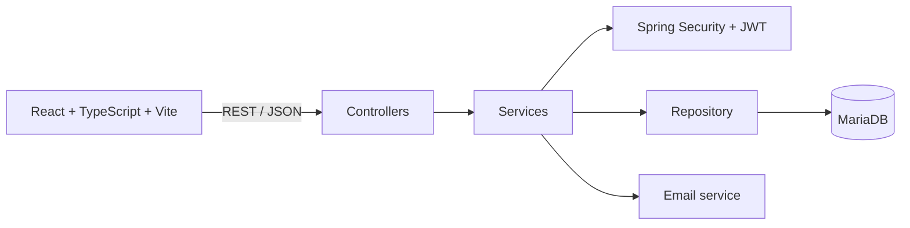
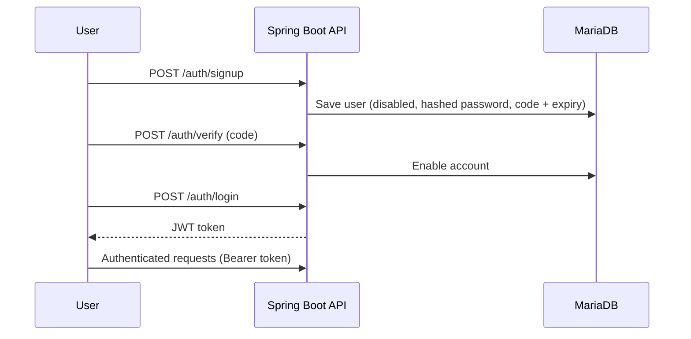

<div align="center">

# 🔐 Full-Stack Authentication Platform

**A secure full-stack web application built with Spring Boot, React and JWT**


[Features](#-features) • [Architecture](#-architecture) • [Getting Started](#-getting-started) • [Roadmap](#-roadmap)

</div>

---

## 📖 About

A full-stack authentication and user-management application. The **Spring Boot** backend exposes REST APIs secured with **Spring Security** and **JWT**, while the **React + TypeScript** frontend handles signup, email verification, login and protected routes.

It implements a complete authentication lifecycle: registration, password hashing, account verification by code, login, token generation and secured access.

---

## ✨ Features

| | Module | Description |
|---|---|---|
| 👤 | **Registration** | Account creation with hashed passwords |
| 📧 | **Account verification** | Time-limited verification code, with resend support |
| 🔑 | **JWT authentication** | Token issued after successful login and validated by a custom filter |
| 🛡️ | **Protected routes** | Restricted access on both API and frontend |
| 👥 | **Users & roles** | User profiles and role-based information |
| 💾 | **Persistence** | Spring Data JPA / Hibernate with MariaDB |
| ⚛️ | **React frontend** | Signup, login and verification pages with shared `AuthContext` |

---

## 🧱 Architecture



**Authentication flow**



| Endpoint | Purpose |
|---|---|
| `POST /auth/signup` | Create an account and generate a verification code |
| `POST /auth/verify` | Validate the code and enable the account |
| `POST /auth/resend` | Generate a new code with a refreshed expiry |
| `POST /auth/login` | Authenticate and return a JWT |

<details>
<summary><b>📂 Project structure</b></summary>

```text
├── backend/                       # Spring Boot (Maven)
│   └── src/main/java/.../
│       ├── config/                # Security, JWT filter, email, app config
│       ├── controllers/           # AuthenticationController, UserController
│       ├── dto/                   # RegisterUserDto, LoginUserDto, VerifyUserDto
│       ├── models/                # User, Role, Gender
│       ├── repo/                  # UserRepository
│       └── services/              # Authentication, Email, Jwt, User
├── frontend/                      # React + Vite
│   └── src/
│       ├── api/ · config/         # API client and configuration
│       ├── context/AuthContext.tsx
│       └── pages/                 # Login, Signup, Verify, ProtectedRoute
└── Diagramme De classe Prof.png   # Class diagram
```

</details>

---

## 🛠️ Tech Stack

| Layer | Technologies |
|---|---|
| **Backend** | Java 21, Spring Boot 3.4.4, Spring Security, Spring Data JPA, Spring Mail, Spring Validation, JJWT, Hibernate, Lombok, Maven |
| **Frontend** | React 19, TypeScript, Vite, React Router, ESLint |
| **Database** | MariaDB |

---

## 🚀 Getting Started

**Prerequisites:** Java 21, Maven, Node.js and npm, MariaDB

```bash
git clone https://github.com/hanaekhayyi/JEE.git
cd JEE
```

**Backend**: configure your MariaDB connection in `backend/src/main/resources/application.properties`, then:

```bash
cd backend
./mvnw spring-boot:run        # Windows: mvnw.cmd spring-boot:run
```

**Frontend**: in a second terminal:

```bash
cd frontend
npm install
npm run dev                   # http://localhost:5173
```

> ⚠️ **Note:** database, JWT and email credentials are currently configured locally. Use environment variables before any deployment (see roadmap).

---

## 🧭 Roadmap

**Security**
- [ ] Move database, JWT and email secrets to environment variables
- [ ] Stop returning verification codes in signup responses and remove debug logs
- [ ] Refresh tokens, password reset and role-based authorization

**Product**
- [ ] User profile management and frontend form validation

**Engineering**
- [ ] Backend integration tests and frontend tests
- [ ] Docker and Docker Compose (frontend, backend, database)
- [ ] Production-ready email verification and deployment

---

<div align="center">

### 👩‍💻 Author

**Hanae KHAYYI** · Data & AI Engineering Student

[](https://github.com/hanaekhayyi)

⭐ *If you found this project useful, feel free to star the repository.*

</div>
